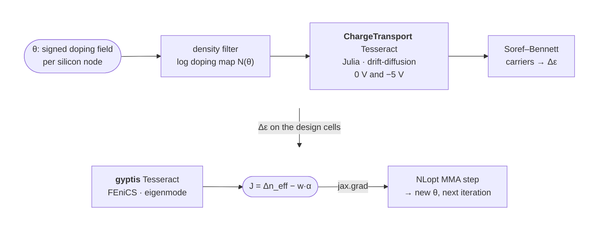

# PRISMO

**P**hotonic **R**econfigurable **I**ntegrated **S**emiconductor **M**ultiphysics **O**ptimization

*Free-form doping inverse design of a silicon PN-junction phase shifter, with the gradient
flowing from the optical mode back through a Julia semiconductor solver — two
solvers, two languages, two adjoints, one `jax.grad`.*

Tesseract Hackathon 2026 entry — **Track 01 · Inverse design & shape optimization**
(it is also a two-solver multi-physics pipeline, Track 02).

<p align="center">
  <a href="https://github.com/benvial/prismo/actions/workflows/test.yaml"></a>
  <a href="https://github.com/benvial/prismo/actions/workflows/pre_commit.yml"></a>
  <a href="https://benvial.github.io/prismo/"></a>
  <a href="https://mybinder.org/v2/gh/benvial/prismo/main?urlpath=lab/tree/notebooks/prismo.ipynb"></a>
  <br>
  <a href="https://pasteurlabs.ai/tesseract-hackathon-2026/"></a>
  <a href="https://github.com/pasteurlabs/tesseract-core"></a>
  <a href="app/pyproject.toml"></a>
  <a href="LICENSE"></a>
</p>

<p align="center">
  
  <br><em>The net doping the two solvers saw at every evaluation of one run: red n-type, blue p-type, white the junction.</em>
</p>

---

## The problem

Every silicon photonic transmitter has phase shifters in it, and almost all of
them are the same device: a rib waveguide with a PN junction across it. Reverse
bias widens the depletion region, sweeps free carriers out of the optical mode,
and the plasma-dispersion effect (Soref–Bennett) raises the refractive index.
The figure of merit is how much the mode's effective index moves per volt,
quoted as **VπLπ** (V·cm; smaller is better), traded against the free-carrier
**loss** the dopants add (dB/cm).

Where to put the dopants is the whole design. Practice today is a handful of
named junction shapes (lateral, L, U, interleaved) tuned one scalar at a time,
because the two physics engines that matter never share a gradient:

- the **carrier transport** is a nonlinear drift-diffusion PDE, solved by TCAD
  tools (here [ChargeTransport.jl](https://github.com/WIAS-PDELib/ChargeTransport.jl), Julia);
- the **optics** is a vector eigenmode problem on the same cross-section, solved
  by EM tools (here [gyptis](https://gyptis.gitlab.io)/legacy FEniCS, a conda-only Python 3.10 stack).

PRISMO treats the doping at **every silicon mesh node** as a design variable
(a signed field θ ∈ [−1, 1]: sign = polarity, magnitude = concentration on a
log scale up to 10¹⁹ cm⁻³) and runs topology optimization on it. That needs
∂(Δn_eff)/∂θ for hundreds of variables per iteration — only an adjoint through
*both* solvers can deliver it.

## The pipeline



One Gmsh mesh of the SOI cross-section (oxide, slab, 500 nm × 220 nm rib,
PML frame, two contact lines) is authored once by the gyptis Tesseract and read
by both solvers, so the carrier field lands on the optical design cells by an
exact restriction, not an interpolation. Per iteration: two drift-diffusion
solves (0 V, −5 V), one eigensolve, two adjoint solves, one eigen-adjoint.

Each solver is a standalone Tesseract exposing `apply` and
`vector_jacobian_product`. The host app (`app/prismo`) wraps each endpoint pair
in a `jax.custom_vjp`, so the whole chain — filter, doping map, carriers,
Soref–Bennett, eigenmode — is a single differentiable JAX function and
`jax.grad` of the objective is the composed adjoint.

### Why this needs Tesseract

| Boundary | What sits on each side | Why it was hard to cross |
|---|---|---|
| **Language** | Julia (ChargeTransport.jl, VoronoiFVM) ↔ Python (JAX, FEniCS) | No shared AD tape. Julia keeps a persistent worker with warm Newton starts behind an HTTP `apply`. |
| **Environment** | Julia 1.10 + Python 3.12 image ↔ conda legacy FEniCS on Python 3.10 | FEniCS 2019 is not pip-installable and cannot coexist with a modern JAX env; each lives in its own image. |
| **AD strategy** | Discrete adjoint of a nonlinear PDE (assemble Jᵀ, solve) ↔ Hellmann–Feynman eigen-adjoint (one left/right eigenpair, field sensitivity per DG0 cell) ↔ JAX autodiff for the glue | Three different notions of "gradient", composed by chain rule through one VJP contract. |
| **State** | A warm-started solver whose answer may depend on solve history | The Tesseract gets a `reset` operation; the run re-solves the optimum cold and reports both, so the headline is a property of the design, not of the path. |

Without Tesseract the alternative is a hand-rolled subprocess protocol per
solver plus a hand-written chain rule between them. With it, every solver is a container with a typed schema
(`components/shared_code/prismo_shared/schemas.py`), the app never imports a
solver, and either side can be swapped (the gyptis Tesseract targets any guided
mode order; a different TCAD backend would only need the same `apply`/VJP).

## Results

All figures are from one run on the container mesh —
`prismo run --use-containers --loss-weight 1e-5 --mesh-size 0.05 --r-min 0.1`
(0.05 µm silicon elements, 0.1 µm filter radius), 192 MMA iterations in
~62 min on a laptop; `outputs/` holds the PDFs of your own runs and
`make figures` refreshes `docs/figures/` from them. The gradient is validated before it is trusted:

<p align="center"></p>

**Composed adjoint vs central finite differences** through filter → doping →
ChargeTransport (Julia, warm) → Soref–Bennett → gyptis: relative error
≈ 2 × 10⁻⁷ at h = 10⁻³, following the O(h²) slope until finite-difference
round-off takes over. (`make validate-gradient-containers`)

<p align="center"></p>

**The gradients do the work.** From the seeded lateral junction, MMA raises
Δn_eff at −5 V from 1.19 × 10⁻⁴ to 3.52 × 10⁻⁴ (×3), i.e. **VπLπ from 3.26 to
1.10 V·cm**. Dips are rejected trials of the move-limited MMA, kept in the
record on purpose. (`prismo run` also re-solves the reported design cold —
worker reset, equilibrium from near-intrinsic, bias ramp — and flags any
warm/cold discrepancy, so the headline is a property of the design, not of
the solve path.)

<p align="center"></p>

**Before / after.** Left: the seed, a lateral junction at |N| ≈ 3 × 10¹⁷ cm⁻³.
Right: the optimum — the junction curls into the rib and wraps the mode centre,
the 2D cross-section of the L-/U-shaped junctions the literature reaches by
hand, while the slab stays lightly doped where the mode does not reach.

<p align="center"></p>

**Where the modulation happens.** Carriers swept out between 0 V and −5 V at
the optimum (orange, log scale), under the mode's |E| contours. The depleted
region sits on the mode peak; doping that the mode cannot see would be loss for
nothing, and the objective knows it.

<p align="center"></p>

**The loss is watched, not ignored.** Modal free-carrier loss α of the unbiased
device (first-order, overlap-weighted Soref–Bennett absorption) and the
literature's efficiency–loss figure of merit VπLπ·α at every iteration. α first
dips (doping the mode cannot see is pruned), then the optimizer buys ~2 dB/cm
back — 4.29 to 6.34 dB/cm — where it pays in Δn_eff, and the figure of merit
**halves, from 14.0 to 7.0 V·dB** (good depletion modulators sit at
10–30 V·dB).

<p align="center"></p>

**Efficiency–loss plane.** The same run as a path from seed to optimum in the
(α, Δn_eff) plane against iso-VπLπ·α curves. `--loss-weight` moves the optimum
along this trade-off.

<p align="center"></p>

The tracked fundamental guided mode of the rib, on the shared mesh (`--mode-index k` targets a higher-order one).

**Honest scope.** 2D cross-section, one bias pair (0 / −5 V), first-order
(overlap-weighted) loss on the rib cells only, Boltzmann statistics, no implant
process model — a prototype that points at the real device, not a tape-out.

## Run it

Prerequisites: Linux or macOS (Windows via WSL2), Docker, `make`, Python ≥ 3.10
in an active virtual environment, ~10 GB of disk for the two images. The solvers
run in containers; the host only needs JAX, NLopt and matplotlib.

```bash
git clone https://github.com/benvial/prismo && cd prismo

make install                      # pip install the host app (+ shared schemas) into the active env
make julia-base chargetransport   # Julia 1.10 + precompiled ChargeTransport.jl base image (~15 min, once)
make build                        # tesseract build both components (gyptis is a conda image, ~10 min)

make test                         # component regression cases + 300 host unit tests
make validate-gradient-containers # adjoint vs finite differences across the real boundary
make run-containers               # the optimization; figures + checkpoint.json land in outputs/
make animate                      # rebuild doping_evolution.{gif,mp4} from outputs/checkpoint.json
```

Useful knobs (`prismo run --help` for all of them):

```bash
make run-containers RUN_ARGS="--loss-weight 1e-5"                   # trade Δneff against modal loss
make run-containers RUN_ARGS="--seed u --contact-offset 0.5"        # start from a U junction, contacts 0.5 µm from the rib
make run-containers RUN_ARGS="--mode-index 1"                       # optimize the first higher-order mode
make run-containers RUN_ARGS="--mesh-size 0.1 --max-iter 50"        # coarse, fast smoke run
make probe-objective-containers RUN_ARGS="--design outputs/checkpoint.json"   # objective smoothness line scan
```

Every run prints Δn_eff (warm and cold), VπLπ, modal loss and VπLπ·α, and
writes `convergence.pdf`, `doping_field.pdf`, `mode_field.pdf`,
`depletion_field.pdf`, `gradient_validation.pdf`, `loss_convergence.pdf`,
`tradeoff.pdf`, `doping_evolution.{gif,mp4}` and `checkpoint.json` (best design
+ full history, resumable by `prismo animate`). There is no stub path: without
the containers `make run` needs both solvers importable (gyptis/FEniCS and
`julia`, as on Binder) and raises otherwise instead of inventing a gradient;
unit tests inject explicit doubles through the `components=` seam.

**In the browser.** The Binder badge above opens
[`notebooks/prismo.ipynb`](notebooks/prismo.ipynb) in a JupyterLab with both
solvers installed in-process (conda gyptis/FEniCS + Julia 1.10 with the same
pinned ChargeTransport.jl environment as the container, from `binder/`). No
Docker there, so it is the `make run` path: the same gyptis-authored mesh,
physics, adjoint and optimizer, with the solvers called in-process instead of
over HTTP. Binder gives ~1 CPU and 2 GB: a minute of JIT warm-up, then a few
seconds per evaluation (a 200-iteration run is ~15 min); a terminal in the same
session takes any `prismo ...` / `make run` command.

Developer loop: `PRISMO_DEV_MOUNTS=1 make run-containers` bind-mounts the host
`tesseract_api.py` / shared schemas into the running images (no rebuild);
`PRISMO_CT_SCRIPTS_DIR=components/tesseracts/chargetransport/scripts` does the
same for the Julia sources; `make images` tells you which image is stale.

## Repository map

```
app/prismo/                     host pipeline (JAX), optimizer, figures, CLI  → `prismo run|validate-gradient|probe-objective|animate`
  pipeline.py                   θ → Δneff, composed adjoint; container start-up
  differentiable_component.py   Tesseract apply/VJP → jax.custom_vjp adapter
  optimizer.py                  move-limited NLopt MMA that survives a failed solve
  density_filter.py  soref_bennett.py  mesh_transfer.py  outputs.py
components/shared_code/         prismo_shared: Pydantic schemas shared by both Tesseracts and the app
components/tesseracts/
  chargetransport/              Python 3.12 + Julia worker: ChargeTransport.jl forward + discrete-adjoint VJP
  gyptis/                       conda FEniCS: shared-mesh author, eigenmode forward + eigen-adjoint VJP
docs/                           physics & equations, the adjoint, implementation choices, structure, glossary
docs/figures/                   the figures above
notebooks/prismo.ipynb          the pipeline as a notebook (Binder runs it; binder/ holds that image's environment)
Makefile                        the only entry point you need
```

## Engineering notes

- **Persistent Julia worker** behind the ChargeTransport `apply`: warm Newton
  starts, doping homotopy at fixed bias, cold bias ramp as last resort, a
  wall-clock solve budget that fails soft so the optimizer can halve its step
  instead of dying. SRH recombination is on because without it the reverse-bias
  steady state of free-form designs was not unique.
- **Move-limited MMA**: one fresh NLopt MMA subproblem per step inside a trust
  box; a failed or non-improving solve halves the box. Best feasible design is
  checkpointed after every evaluation.
- **Objective line scan** (`probe-objective`) found a 2 × 10⁻³ relative noise
  floor in the eigensolve (non-pivoting LU in the shift-invert transform) that
  was stalling the optimizer; a pivoting LU brought it to 2 × 10⁻¹¹.
- **Julia base image**: the precompiled depot lives in a base image so a
  `tesseract build` after a code change relayers only the Python venv and
  scripts (seconds, not minutes).

Full documentation — [the physics and equations](docs/physics.md), [the
composed adjoint](docs/adjoint.md), [implementation choices](docs/design.md),
[project structure](docs/architecture.md), [glossary](docs/glossary.md) — is
in `docs/` (`pip install -e "app[docs]" && make docs` for the Sphinx site).

## License

Apache 2.0 — see [LICENSE](LICENSE). Written during the Tesseract Hackathon
2026 (August 3–31).
