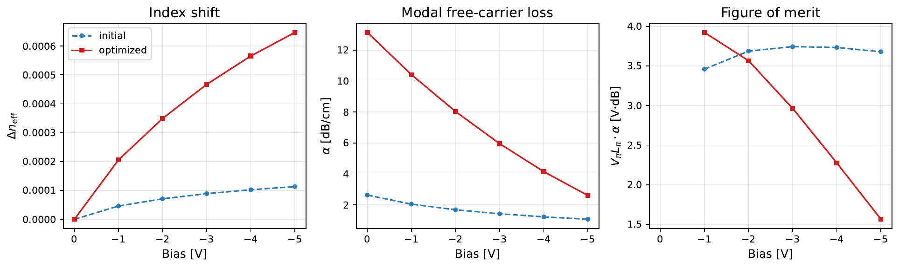

# PRISMO

**P**hotonic **R**econfigurable **I**ntegrated **S**emiconductor **M**ultiphysics **O**ptimization

PRISMO uses gradient-based optimization to find better doping layouts for
silicon PN-junction phase shifters, the device that sets the phase of light in
most silicon photonic transmitters.

Instead of choosing from a few textbook junction shapes, it treats the doping
across the whole silicon cross-section as a design field and lets the optimizer
change it freely. The carrier transport and the optical mode are computed by
two separate physics codes, in two languages, that were never written to work
together. PRISMO connects their gradients so the complete simulation can be
differentiated.

On the reference run, the optimized design shifts the effective index 5.7×
more than the starting design at −5 V, reducing **VπLπ from 3.42 to
0.60 V·cm** (lower is better). The efficiency-loss figure of merit ends at
**7.9 V·dB**.

<p align="center">
  
  <br>
  <em>The doping field at every step of one optimization run. Red is n-type, blue is p-type, white is the junction between them.</em>
</p>

<p align="center">
  <a href="https://github.com/benvial/prismo/actions/workflows/test.yaml"></a>
  <a href="https://github.com/benvial/prismo/actions/workflows/pre_commit.yml"></a>
  <a href="https://bvial.info/prismo/"></a>
  <a href="https://mybinder.org/v2/gh/benvial/prismo/main?urlpath=lab/tree/notebooks/prismo.ipynb"></a>
  <br>
  <a href="https://github.com/pasteurlabs/tesseract-core"></a>
  <a href="app/pyproject.toml"></a>
  <a href="LICENSE"></a>
</p>

---

## What is being optimized?

Silicon photonic transmitters use PN-junction phase shifters. Applying a
reverse bias pushes free carriers out of the waveguide, which changes its
refractive index and therefore the phase of the guided light.

The design problem is simple to state: where should the dopants go?

In conventional designs the answer is one of a small number of hand-drawn
junction geometries (lateral, L-shaped, U-shaped, interleaved), tuned a
parameter at a time. PRISMO instead makes the doping at every silicon mesh node
a design variable and uses topology optimization to search for a better
arrangement.

The efficiency metric is **VπLπ**, in V·cm: how much voltage times device
length you need for a π phase shift. Lower is better. The starting U junction
at 3.42 V·cm is a conventional value, and designs below 1 V·cm count as
efficient. There is a trade-off, because heavier doping also absorbs light, so
the literature quotes the product of VπLπ and the propagation loss α as a
second figure of merit, in V·dB. PRISMO optimizes the modulation efficiency
while keeping the loss in the objective.

## What is new here?

The optimization itself is not the difficult part. The difficult part is
getting a trustworthy gradient through two different physics solvers.

Carrier transport is solved with
[ChargeTransport.jl](https://github.com/WIAS-PDELib/ChargeTransport.jl), a
Julia implementation of the nonlinear drift-diffusion equations. The optical
mode is solved with [gyptis](https://gyptis.gitlab.io/), a finite-element code
on legacy FEniCS in Python. Neither was written for PRISMO, and I did not
modify either of them.

PRISMO connects their forward solves and their adjoints so that the whole
pipeline is one differentiable JAX function:


The result is a free-form inverse-design loop that spans Julia, Python,
semiconductor transport and electromagnetics, with a gradient that is the exact
composition of the two solvers' adjoints rather than a finite-difference
approximation.

## The result

The reference run starts from a U-shaped PN junction. After 192 MMA iterations
the optimized design has a much larger index change at −5 V:

* **Δn_eff:** 1.13 × 10⁻⁴ to 6.47 × 10⁻⁴, a 5.7× gain
* **VπLπ:** 3.42 to **0.60 V·cm**
* **VπLπ·α:** 9.0 to **7.9 V·dB**

The 7.9 V·dB uses the unbiased, first-order modal loss, so it is the
conservative reading. The bias-resolved value at −5 V is lower, see the bias
sweep below.

<p align="center">
  
  <br>
  <em>Initial U-shaped junction (left) and optimized doping distribution (right).</em>
</p>

The optimizer closes the U into a ring around the centre of the optical mode:
a p-type core at the doping ceiling, enclosed by n-type on all sides. This puts
more junction perimeter where the optical field is strong, so a larger
depletion region overlaps the mode. The outer slab, where the mode does not
reach, is left almost untouched. Doping there would only add absorption.

<p align="center">
  
  <br>
  <em>Carriers swept out between 0 V and −5 V (orange, log scale) under the mode's |E| contours.</em>
</p>

The depletion region wraps around the ring junction and covers most of the
mode peak. That overlap is where the 5.7× comes from. The pale band in the
middle is the interior of the p core, too far from any junction to deplete.

<p align="center">
  
</p>

The dips in the convergence history are rejected trials of the move-limited
optimizer, left in the record on purpose.

## How the two solvers are connected

Both solvers use the same Gmsh mesh of the silicon-on-insulator cross-section:
oxide, slab, a 500 nm × 220 nm rib, a PML frame and two contact lines. The
gyptis component writes it once and the ChargeTransport component reads it, so
the carrier solution lands on the optical design cells by exact restriction
rather than by interpolation between unrelated meshes.

Each optimization iteration involves:

1. a drift-diffusion solve at 0 V;
2. a drift-diffusion solve at −5 V;
3. a guided-mode eigensolve;
4. two carrier-transport adjoint solves;
5. one eigenmode adjoint.

<p align="center">
  
  <br>
  <em>The tracked fundamental mode of the rib on the shared mesh. <code>--mode-index k</code> targets a higher-order one.</em>
</p>

The two physics codes are exposed as Tesseract components. Each provides a
forward `apply` and a matching `vector_jacobian_product`, behind a typed
Pydantic schema. The host application uses
[tesseract-jax](https://github.com/pasteurlabs/tesseract-jax) to place those
components into a JAX computation, and then differentiates the complete
objective with `jax.grad`.

### Why Tesseract?

Tesseract is infrastructure here, not the scientific result.

It gives the two existing solvers a common interface, so they can be composed
without either one importing the other. Each component exposes its forward
operation and its VJP, and the host application handles the chain rule between
them. Without this layer, the same workflow would need a custom subprocess
protocol per solver and a hand-written chain rule connecting them.

The interface also makes the components replaceable. A different
carrier-transport backend could implement the same `apply`/VJP contract, and
the optical component can target a different guided mode. See the
[Tesseract documentation](https://docs.pasteurlabs.ai/projects/tesseract-core/latest/)
for the component mechanics.

<details>
<summary><b>The four boundaries this project crosses</b></summary>

| Boundary | What sits on each side | Why it matters |
|---|---|---|
| **Language** | Julia (`ChargeTransport.jl`, VoronoiFVM) and Python (JAX, FEniCS) | No shared automatic-differentiation tape. Julia runs as a persistent worker with warm Newton starts behind an HTTP `apply`. |
| **Environment** | Julia 1.10 + Python 3.12, and legacy FEniCS on Python 3.10 | FEniCS 2019 is conda-only and cannot coexist with a modern JAX environment. Each lives in its own image. |
| **AD strategy** | Discrete PDE adjoint, Hellmann–Feynman eigenmode adjoint, and JAX autodiff for the glue | Three different notions of "gradient", composed through one VJP interface. |
| **State** | A warm-started nonlinear solver | Solve history can affect the answer, so the component gets a `reset` operation and the final design is re-solved from a cold start before it is reported. |

The shared schemas used by both sides are in
`components/shared_code/prismo_shared/schemas.py`.

</details>

## Checking the gradient

Before trusting an optimization driven by an adjoint, the gradient has to be
checked. PRISMO compares the composed adjoint against central finite
differences through the complete chain, from filter to eigenmode.

<p align="center">
  
</p>

The test covers nine step sizes from 10⁻¹ to 10⁻⁵. Above the minimum the error
falls with a measured log-log slope of 1.94, close to the second-order
behaviour a central difference should show. Below it, evaluation noise divided
by the step takes over and the error climbs back. Sampling both branches is
what makes this a convergence test rather than a single lucky number.

The best agreement is **5.3 × 10⁻⁷ at h ≈ 3 × 10⁻³**, well below the 10⁻²
acceptance threshold. Run the same check with:

```bash
make validate-gradient-containers
```

## Optimization behaviour

### Efficiency against loss

<p align="center">
  
</p>

Modal free-carrier loss of the unbiased device and the figure of merit VπLπ·α
at every iteration. The optimizer spends loss (2.64 to 13.2 dB/cm) wherever it
pays back in Δn_eff, which rises faster, so the product still improves from
9.0 to 7.9 V·dB.

<p align="center">
  
</p>

The same run as a path from seed to optimum in the (α, Δn_eff) plane, against
curves of constant VπLπ·α. The path tracks one of those curves outwards. The
`--loss-weight` option is what moves the optimum between them, not the
iteration count.

### The seed picks the basin

MMA is a local optimizer, so the initial topology matters. Three seeds under
identical settings on the 0.05 µm mesh, 192 iterations each:

| Seed | Δn_eff | α [dB/cm] | VπLπ [V·cm] | VπLπ·α [V·dB] |
|---|---:|---:|---:|---:|
| `u` | 6.21 × 10⁻⁴ | 11.9 | **0.62** | 7.40 |
| `lateral` | 3.52 × 10⁻⁴ | 6.34 | 1.10 | 6.98 |
| `vertical` | 3.74 × 10⁻⁴ | 8.84 | 1.04 | 9.16 |

The U seed gives the largest index change, 1.8× the others at a figure of merit
within 6% of the best, which is why it is the default. The spread between seeds
is larger than anything the optimizer settings move, so a multi-start is worth
more than tuning the solver.

The `lateral` run also failed its cold re-solve, so its value remains dependent
on the warm solver path. The `u` and `vertical` runs reproduced their numbers
after a cold solve.

### Mesh refinement

The same U-seed run at three silicon element sizes, everything else fixed. The
filter radius is a physical length, so the minimum feature stays at 0.1 µm
across all three.

| Element size [µm] | Design cells | Δn_eff | α [dB/cm] | VπLπ [V·cm] | VπLπ·α [V·dB] |
|---:|---:|---:|---:|---:|---:|
| 0.05 | 116 | 6.21 × 10⁻⁴ | 11.9 | 0.62 | 7.40 |
| 0.04 | 196 | 6.78 × 10⁻⁴ | 14.2 | 0.57 | 8.10 |
| 0.03 | 324 | 6.47 × 10⁻⁴ | 13.2 | 0.60 | 7.87 |

All three converge to the same ring topology and all three reproduce their
numbers after a cold solve, so the design is not a discretization artefact.
The values do not vary monotonically with mesh size, though: VπLπ ranges from
0.57 to 0.62 V·cm. The mode-overlap weights are essentially unchanged across
the three meshes (0.5717, 0.5719, 0.5718), so the optical side is converged.
The spread comes from which local optimum MMA settles into, and it is the real
uncertainty on the headline. The figures above are from the 0.03 µm run.

### Bias sweep

The objective only sees 0 and −5 V. A bias sweep is run afterwards
(`--bias-sweep-points`) to see how the design behaves away from the
optimization point.

<p align="center">
  
</p>

The optimized design keeps a 4.5 to 5.7× gain in Δn_eff over the seed across
the whole range, so the improvement is not tied to the one voltage it was
optimized at.

Here the loss is read from the carriers at each bias, so it falls as the
junction empties: from 13.2 dB/cm at 0 V to 2.6 dB/cm at −5 V for the
optimized design, while the lightly doped seed barely moves. At −5 V the
bias-resolved product reaches **1.56 V·dB** and crosses below the seed just
past −2 V. Above that, the seed's lighter doping still wins on the product.
The design was optimized at −5 V and it shows. The 7.9 V·dB headline uses the
objective's fixed 0 V loss and is the more conservative measure.

## Scope and limitations

This is a 2D research prototype, not a tape-out-ready device design. The
current model uses:

* a 2D SOI cross-section;
* one optimization bias pair, 0 and −5 V;
* first-order, overlap-weighted free-carrier loss on the rib cells;
* Boltzmann statistics;
* no implant process model;
* a free-form doping field constrained by the density filter and doping map.

The results demonstrate the optimization workflow and the composed adjoint.
They should not be read as a prediction for a fabricated device.

The next steps follow directly from these limitations:

* a 3D cross-section;
* a bias-resolved objective;
* an implant process model;
* a second TCAD backend behind the same `apply`/VJP interface;
* a systematic multi-start.

## Run it

The easiest way to run the full pipeline is with the containerized solvers.
You need:

* Linux or macOS, or Windows through WSL2;
* Docker;
* `make`;
* Python 3.12 or newer in an active virtual environment;
* about 10 GB of disk for the two solver images.

The host environment only needs JAX, NLopt and matplotlib. The two physics
solvers run in their own images.

```bash
git clone https://github.com/benvial/prismo && cd prismo

make install                      # pip install the host app (+ shared schemas) into the active env
make julia-base chargetransport   # Julia 1.10 + precompiled ChargeTransport.jl base image (~15 min, once)
make build                        # tesseract build both components (gyptis is a conda image, ~10 min)

make test                         # component regression cases + 300 host unit tests
make validate-gradient-containers # adjoint vs finite differences across the real boundary
make run-containers               # the optimization; figures + checkpoint.json land in outputs/
make animate                      # rebuild doping_evolution.{gif,mp4} from outputs/checkpoint.json
```

The Julia base image is cached, so later builds take seconds rather than
minutes. Useful options:

```bash
make run-containers RUN_ARGS="--loss-weight 1e-5"                   # trade Δn_eff against modal loss
make run-containers RUN_ARGS="--seed u --contact-offset 0.5"        # start from a U junction, contacts 0.5 µm from the rib
make run-containers RUN_ARGS="--mode-index 1"                       # optimize the first higher-order mode
make run-containers RUN_ARGS="--mesh-size 0.1 --max-iter 50"        # coarse, fast smoke run
make probe-objective-containers RUN_ARGS="--design outputs/checkpoint.json"   # objective smoothness line scan
```

`prismo run --help` lists all of them.

Each run prints Δn_eff (warm and cold), VπLπ, modal loss and VπLπ·α, and writes
the figures above as PDFs to `outputs/`, plus `doping_evolution.{gif,mp4}` and
`checkpoint.json`. The checkpoint holds the best design and the full history
and can regenerate the animation with `prismo animate`.

There is no fallback that silently replaces a missing solver. Without the
containers, `make run` needs both solvers importable (gyptis/FEniCS and
`julia`, as on Binder) and raises otherwise. Unit tests inject explicit doubles
through the `components=` seam.

### In the browser

The Binder badge at the top opens
[`notebooks/prismo.ipynb`](notebooks/prismo.ipynb) in JupyterLab with both
solvers installed in-process, using the same gyptis/FEniCS and pinned Julia
environments as the containers (built from `binder/`). No Docker there, so it
takes the `make run` path: same mesh, physics, adjoint and optimizer.

Binder gives about 1 CPU and 2 GB of memory. Expect a minute of Julia JIT
warm-up, then a few seconds per evaluation, so a 200-iteration run is around
15 minutes. A terminal in the same session takes any `prismo ...` or
`make run` command.

### Development

The container setup can mount source files from the host without rebuilding
the images:

```bash
PRISMO_DEV_MOUNTS=1 make run-containers        # bind-mount tesseract_api.py and the shared schemas
PRISMO_CT_SCRIPTS_DIR=components/tesseracts/chargetransport/scripts make run-containers   # same for the Julia sources
make images                                    # which image is stale
```

## Repository structure

```text
app/prismo/                     host pipeline (JAX), optimizer, figures, CLI: prismo run|validate-gradient|probe-objective|animate
  pipeline.py                   θ to Δn_eff, composed adjoint (tesseract-jax), container start-up
  optimizer.py                  move-limited NLopt MMA that survives a failed solve
  density_filter.py  soref_bennett.py  mesh_transfer.py  outputs.py
components/shared_code/         prismo_shared: Pydantic schemas shared by both Tesseracts and the app
components/tesseracts/
  chargetransport/              Python 3.12 + Julia worker: ChargeTransport.jl forward + discrete-adjoint VJP
  gyptis/                       conda FEniCS: shared-mesh author, eigenmode forward + eigen-adjoint VJP
docs/                           physics and equations, the adjoint, implementation choices, structure, glossary
docs/figures/                   the figures in this README
notebooks/prismo.ipynb          the pipeline as a notebook (Binder runs it; binder/ holds that image's environment)
Makefile                        the main entry point for building, testing and running
```

## A few implementation details

The ChargeTransport component runs a persistent Julia worker. Warm Newton
starts make repeated evaluations much cheaper, with a doping homotopy at fixed
bias and a cold bias ramp as fallbacks. A wall-clock solve budget lets a failed
solve return control to the optimizer, which halves its step instead of
terminating the run. SRH recombination is on because without it the
reverse-bias steady state of free-form designs was not always unique.

The optimizer is a move-limited NLopt MMA: one fresh subproblem per step inside
a trust box. A failed or non-improving solve halves the box, and the best
feasible design is checkpointed after every evaluation.

The `probe-objective` command scans the objective along a line and was useful
during development. It exposed a 2 × 10⁻³ relative noise floor in the
eigensolve, from the non-pivoting LU in the shift-invert transform, that was
stalling the optimizer. A pivoting LU brought it down to 2 × 10⁻¹¹.

The Julia dependencies are precompiled into a base image, so a
`tesseract build` after a code change only relayers the Python environment and
scripts rather than the whole Julia stack.

## Documentation

The full documentation is in [`docs/`](docs/):

* [Physics and equations](docs/physics.md)
* [Composed adjoint](docs/adjoint.md)
* [Implementation choices](docs/design.md)
* [Project architecture](docs/architecture.md)
* [Glossary](docs/glossary.md)

Build it with `pip install -e "app[docs]" && make docs`, or read it at
[bvial.info/prismo](https://bvial.info/prismo/).

## Status

PRISMO is a research prototype with a complete end-to-end pipeline. The forward
simulations, composed adjoint, optimization and figures all run from the
repository, and the gradient is checked against finite differences before it
is used. Every number above is reproducible from the commands in this README.

It is not meant to produce a tape-out-ready device. The limitations listed
above are part of the project, not something hidden behind the headline.

I maintain it on a best-effort basis alongside other work. Bug reports,
questions and pull requests are welcome on the
[issue tracker](https://github.com/benvial/prismo/issues). If you want to plug
in a different solver or try the pipeline on another device, open an issue and
I will help.

## Citing and contact

PRISMO is by Benjamin Vial ([bvial.info](https://bvial.info)). If you use it in
your work, please cite the repository. GitHub's "Cite this repository" button
reads [CITATION.cff](CITATION.cff), or in plain text:

```text
Vial, B. (2026). PRISMO: free-form doping inverse design of a silicon
PN-junction phase shifter. https://github.com/benvial/prismo
```

## Origin

PRISMO started as an entry to the
[Tesseract Hackathon 2026](https://pasteurlabs.ai/tesseract-hackathon-2026/),
held from August 3 to 31, in the inverse design and multi-physics tracks. Most
of it was written in those four weeks. The organisers' write-up will be linked
here once it is published.

## License

Apache 2.0. See [LICENSE](LICENSE).
