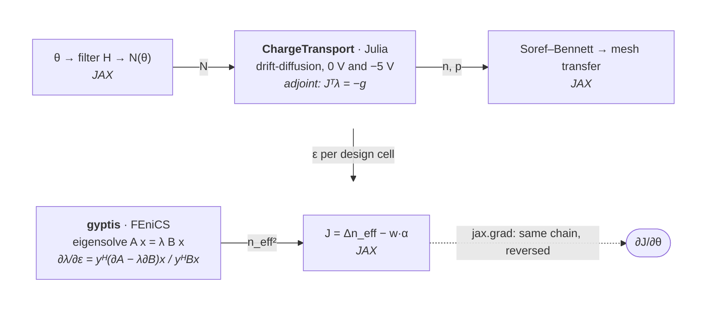

# Gradients: the composed adjoint

The objective is a scalar function of hundreds of design variables, so the
gradient is computed in reverse mode: one adjoint solve per solver per
evaluation, whatever the number of variables. Three different "adjoints" are
chained, each living where its solver lives.

`jax.grad(J)` walks this chain backwards. Each Tesseract call is a
`jax.custom_vjp` whose forward is the component's `apply` (reached through
`jax.pure_callback`) and whose backward is its `vector_jacobian_product`
endpoint; everything between the two solvers is ordinary JAX autodiff.

## Discrete adjoint of the drift-diffusion solve

At each bias the solver finds the state $x = (\psi, \varphi_n, \varphi_p)$ of
the finite-volume residual $F(x; N) = 0$ and reads out the carrier densities
$n(x), p(x)$ per node. Given the cotangents $\bar n, \bar p$ arriving from
downstream, the Tesseract's VJP returns $\bar N = \mathrm{d}J/\mathrm{d}N$:

1. **State gradient.** $g = (\partial n/\partial x)^\top \bar n +
   (\partial p/\partial x)^\top \bar p$, assembled per DOF by differencing the
   (smooth, local) density read-out.
2. **Adjoint solve.** $J_F^\top \lambda = -g$ with $J_F = \partial F/\partial x$
   the assembled Jacobian VoronoiFVM already builds for Newton. The Ohmic
   contacts are enforced by a $10^{30}$ Dirichlet penalty on their rows, which
   makes the full Jacobian's condition number $\sim 10^{42}$; those rows are
   eliminated first (the constrained state is known exactly) and the physical
   block is factorized with partial pivoting. The sensitivity of the pinned
   DOFs re-enters through the well-scaled coupling column
   $\lambda_\mathrm{free}^\top J_F[\mathrm{free}, c]$.
3. **Explicit doping term.** Doping enters the bulk residual only through the
   Poisson source, so $\bar N_i \mathrel{+}= \lambda_{\psi,i}\, q\,
   \lambda_1\, |\Omega_i|$ (node volume) — a contracted analytic derivative, not
   a residual finite difference.
4. **Contact path.** Out of equilibrium the contacts are held at
   $\psi = \psi_\mathrm{eq} + U$, and $\psi_\mathrm{eq}$ is itself an output of
   the equilibrium solve — a local function of the doping at the contact node
   through charge neutrality, $\mathrm{d}\psi_\mathrm{eq}/\mathrm{d}N =
   1 / (\mathrm{d}/\mathrm{d}\psi \sum_\alpha z_\alpha n_\alpha)$
   ($-U_T/(n+p)$ for Boltzmann statistics). At reverse bias the rib is depleted
   and this path carries most of the gradient; dropping it leaves the composed
   gradient wrong by more than half.

The adjoint is taken at the warm-started converged state the forward returned,
and the sign/unit conversion between PRISMO's donor-positive $\mathrm{cm^{-3}}$
doping and the solver's acceptor-positive SI convention is undone on the way
out. Two forward solves and two adjoint solves per iteration (0 V and −5 V);
the loss term rides on the 0 V adjoint at no extra cost.

## Hellmann–Feynman eigen-adjoint

For the generalized eigenproblem $A(\varepsilon)\, x = \lambda\, B(\varepsilon)\, x$
with right eigenvector $x$ and left eigenvector $y$ ($y^H A = \lambda\, y^H B$),
the first-order change of the eigenvalue with a per-cell permittivity
$\varepsilon_c$ is

$$
\frac{\partial \lambda}{\partial \varepsilon_c} =
\frac{y^H \bigl(\partial A/\partial\varepsilon_c - \lambda\, \partial B/\partial\varepsilon_c\bigr) x}
     {y^H B\, x},
\qquad
\frac{\partial (n_\mathrm{eff}^2)}{\partial \varepsilon_c} = \frac{1}{k_0^2}\,\frac{\partial\lambda}{\partial\varepsilon_c}.
$$

The gyptis Tesseract recovers $x$ and $y$ from **one** two-sided SLEPc solve
(shared by forward and adjoint), and assembles the numerator for *all* design
cells in a single pass by testing the $\varepsilon$-derivative density of the
weak form against a DG0 test function — no per-cell loop, no re-solve. The
result is the field $w_c = \partial(n_\mathrm{eff}^2)/\partial\varepsilon_c$ on
the design cells; the VJP multiplies it by the incoming scalar cotangent. The
same $w_c$, evaluated once at the uniform background, is the mode-overlap
weight of the modal loss.

pyadjoint does not tape the SLEPc eigensolve, which is why this adjoint is
written by hand. The shift-invert transform behind the solve is factorized with
a pivoting direct solver (UMFPACK): the assembled system is an indefinite
saddle point, and PETSc's native non-pivoting LU left a $2\times10^{-3}$
relative noise floor on $\Delta n_\mathrm{eff}$ that the adjoint could not
explain and the optimizer could not descend through. With pivoting the
eigenvalue is smooth along a design line to $10^{-13}$ and the noise floor is
$2\times10^{-11}$.

## The JAX glue

- **Density filter**: a dense $(n_\mathrm{design}, n_\mathrm{design})$ matrix;
  its VJP is the transpose, written as a `custom_vjp` so the matrix is not
  traced.
- **Doping map** $N(\theta)$: custom JVP so the derivative is the even,
  continuous $N_\mathrm{ref}\ln 10\, s\, 10^{s|\theta|}$ at the junction too.
- **Soref–Bennett**: the signed power $\operatorname{sign}(x)|x|^p$ gets a
  custom VJP ($p|x|^{p-1}$, set to zero at $x = 0$ where $p < 1$ would blow
  up) so depletion differentiates cleanly.
- **Mesh transfer**: a constant restriction matrix (1/3 per vertex, zero elsewhere).
- **Design nodes**: only silicon nodes carry $\theta$; the filtered field is
  scattered into full node order before the doping map, so the transposes are
  plain gathers.

## Validation

`prismo validate-gradient` (`make validate-gradient-containers`) compares the
composed adjoint's directional derivative $\nabla J \cdot d$ against central
finite differences $[J(\theta + h d) - J(\theta - h d)] / 2h$ along sampled
unit directions $d$, for $h \in \{10^{-2}, 10^{-3}, 10^{-4}\}$, and gates on a
stated relative tolerance. Across the real Julia + FEniCS boundary the error
follows the $O(h^2)$ slope to $\approx 2\times10^{-6}$ at $h = 10^{-3}$ before
finite-difference round-off takes over (the drift-diffusion adjoint reads the
density through an internal $10^{-8}$ difference, and the eigensolver carries
its tolerance). `--cold` resets the ChargeTransport worker before every
evaluation so no finite-difference sample inherits another's Newton start.

`prismo probe-objective` is the complementary smoothness gauge: it samples
$J(\theta_0 + t\,d)$ at uniform spacing, fits a quadratic, and reports the fit
residual, the white-noise amplitude implied by second differences, and the
adjoint's slope against the fitted one. A kink shows as a structured residual
that shrinks with the spacing; an evaluation noise floor shows as a white
residual that does not.
