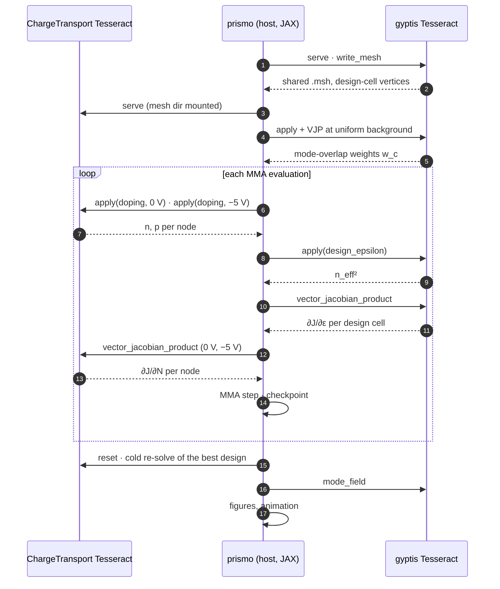

# Project structure

```text
app/prismo/                     host pipeline (JAX), optimizer, figures, CLI
  main.py                       `prismo run | validate-gradient | probe-objective | animate`
  pipeline.py                   θ → objective, composed adjoint; container start-up; mesh authoring
  differentiable_component.py   Tesseract apply/VJP → jax.custom_vjp adapter
  optimizer.py                  move-limited NLopt MMA that survives a failed solve
  density_filter.py             Andreassen density filter (H matrix)
  soref_bennett.py              carriers → Δε, Δα
  mesh_transfer.py              nodal field → design-cell restriction
  waveguide_mesh.py             local (non-container) rib mesh author
  outputs.py                    figures, gradient validation, line scan, animation
app/tests/                      unit tests; solver doubles injected through `components=`
components/shared_code/         prismo_shared: Pydantic schemas shared by both Tesseracts and the app
components/tesseracts/
  chargetransport/              Python 3.12 + Julia 1.10 worker: ChargeTransport.jl forward + discrete-adjoint VJP
    tesseract_api.py            apply (solve | reset), vector_jacobian_product; owns the worker process
    scripts/worker.jl           JSON-lines worker loop; ct_common.jl (system, continuation), ct_adjoint.jl (VJP)
    Dockerfile.julia-base       precompiled Julia depot (`make julia-base chargetransport`)
    julia_env/                  pinned Project.toml / Manifest.toml
  gyptis/                       conda FEniCS: shared-mesh author, eigenmode forward + eigen-adjoint VJP
    tesseract_api.py            apply (solve | write_mesh | design_cell_centroids | mode_field), VJP
    tesseract_environment.yaml  conda env (gyptis, legacy dolfin, Python 3.10)
  <component>/test_cases/       JSON regression cases run by `make test <component>`
docs/                           this documentation; docs/figures/ holds the README figures
scripts/                        benchmark + the standalone eigen-adjoint prototype
Makefile                        the entry point: install, build, test, run, validate, figures, docs
```

## Components

| Tesseract | Image | Solves | Inputs → outputs | Differentiation |
|---|---|---|---|---|
| `prismo_chargetransport` | Python 3.12 + Julia 1.10 | drift-diffusion on the silicon subdomain | `doping` (per node, cm⁻³), `mesh_ref`, `bias_voltage` → `electrons`, `holes` (per node) | discrete adjoint: $J_F^\top$ solve in the Julia worker |
| `prismo_gyptis` | conda, legacy FEniCS, Python 3.10 | vector eigenmode on the full domain | `design_epsilon` (per design cell), `mode_index` → `neff_sq`; plus `write_mesh`, `design_cell_centroids`, `mode_field` operations | Hellmann–Feynman eigen-adjoint, one left/right eigenpair |

Both images install `prismo_shared` — the Pydantic schemas (`MeshRef`,
`SorefBennettCoefficients`, carrier fields, solver sessions) that define the
exchange format. The host app never imports a solver: it talks to the two
served containers through `tesseract_core.Tesseract`.

## A run, step by step



1. `init_tesseract_containers` starts both images (`Tesseract.from_image(...).serve()`),
   forwarding mesh size / contact offset / domain width to the gyptis author
   and the solve budget to the Julia worker; the output directory is
   bind-mounted into the ChargeTransport container for the mesh file.
2. `write_mesh` on gyptis authors the shared `.msh`; the host reads the design
   cell vertices and assembles the mesh-transfer matrix and the silicon design
   nodes; the density filter matrix is built on the design-node coordinates.
3. `read_mode_overlap` runs one eigensolve + one adjoint at the uniform
   background to get the frozen overlap weights for the loss.
4. The optimizer loop: `pipeline_with_terms(θ)` evaluates the objective —
   filter, doping map, two ChargeTransport solves (0 V, −5 V), Soref–Bennett,
   transfer, eigensolve — and `jax.grad` of it pulls the two drift-diffusion
   adjoints and the eigen-adjoint. NLopt MMA proposes the next θ inside the
   move-limit box. `checkpoint.json` and a doping frame are written after
   every evaluation.
5. Afterwards: mode field and swept-carrier figures at the optimum (warm),
   then a worker `reset` and a cold re-solve of the best design; the headline
   is computed from the cold value. Figures and the animation are written to
   `outputs/`; `make figures` rasterizes them into `docs/figures/`.

`validate-gradient` and `probe-objective` start from the same
`build_pipeline_inputs` so they solve on exactly the same mesh, filter,
transfer and seed as `run`.

## Developer loop

- `PRISMO_DEV_MOUNTS=1 make run-containers` bind-mounts the host
  `tesseract_api.py` and `prismo_shared` over both images, read-only — a Python
  component edit costs a container restart instead of an image rebuild. The
  CLI prints a banner whenever the mounts are active.
- `PRISMO_CT_SCRIPTS_DIR=components/tesseracts/chargetransport/scripts` mounts
  the Julia sources over `/tesseract/scripts`; the sysimage still supplies the
  precompiled packages.
- `make images` shows whether each image is older than the last commit
  touching its sources. A dependency change (`tesseract_requirements.txt`,
  `tesseract_environment.yaml`, `julia_env/*.toml`) always needs a rebuild.
- `PRISMO_CT_SOLVE_BUDGET_S` / `PRISMO_CT_JULIA_TIMEOUT_S` stretch the Julia
  solve budget and the request timeout for refined meshes.
- `make test` runs each component's JSON regression cases against its image
  (`tesseract run <image> test @case.json`) and then the host unit tests
  (`pytest app`). `make gen-tests <component> FILE=payload.json` captures a
  new regression case from a live `apply`.
- Tesseract's own tools apply: `tesseract run ... --profiling --tracing`,
  `tesseract serve --debug`, `tesseract-runtime` against a bare
  `tesseract_api.py` for a no-container debugging loop.
