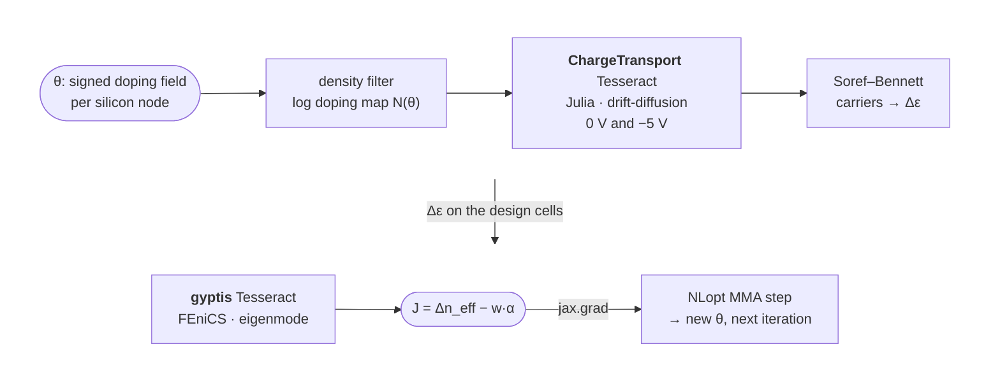

# The problem

Every silicon photonic transmitter has phase shifters in it, and almost all of
them are the same device: a rib waveguide with a PN junction across it. Reverse
bias widens the depletion region, sweeps free carriers out of the optical mode,
and the plasma-dispersion effect (Soref–Bennett) raises the refractive index.
The figure of merit is how much the mode's effective index moves per volt,
quoted as $V_\pi L_\pi$ (V·cm; smaller is better), traded against the
free-carrier loss the dopants add (dB/cm).

Where to put the dopants is the whole design. Practice today is a handful of
named junction shapes (lateral, L, U, interleaved) tuned one scalar at a time,
because the two physics engines that matter never share a gradient:

- the **carrier transport** is a nonlinear drift-diffusion PDE, solved by TCAD
  tools — here [ChargeTransport.jl](https://github.com/WIAS-PDELib/ChargeTransport.jl), in Julia;
- the **optics** is a vector eigenmode problem on the same cross-section,
  solved by EM tools — here [gyptis](https://gyptis.gitlab.io) on legacy FEniCS,
  a conda-only Python 3.10 stack.

PRISMO treats the doping at **every silicon mesh node** as a design variable
(a signed field $\theta \in [-1, 1]$: sign = polarity, magnitude =
concentration on a log scale up to $10^{19}\,\mathrm{cm^{-3}}$) and runs
topology optimization on it. That needs $\partial \Delta n_\mathrm{eff} /
\partial \theta$ for hundreds of variables per iteration — only an adjoint
through *both* solvers can deliver it.

## The pipeline

One Gmsh mesh of the SOI cross-section (oxide, slab, 500 nm × 220 nm rib, PML
frame, two contact lines) is authored once by the gyptis Tesseract and read by
both solvers, so the carrier field lands on the optical design cells by an
exact restriction, not an interpolation. Per iteration: two drift-diffusion
solves (0 V, −5 V), one eigensolve, two adjoint solves, one eigen-adjoint.

Each solver is a standalone Tesseract exposing `apply` and
`vector_jacobian_product`. The host app (`app/prismo`) wraps each endpoint
pair in a `jax.custom_vjp`, so the whole chain — filter, doping map, carriers,
Soref–Bennett, eigenmode — is a single differentiable JAX function and
`jax.grad` of the objective is the composed adjoint.

## Why this needs Tesseract

| Boundary | What sits on each side | Why it was hard to cross |
|---|---|---|
| **Language** | Julia (ChargeTransport.jl, VoronoiFVM) ↔ Python (JAX, FEniCS) | No shared AD tape. Julia keeps a persistent worker with warm Newton starts behind an HTTP `apply`. |
| **Environment** | Julia 1.10 + Python 3.12 image ↔ conda legacy FEniCS on Python 3.10 | FEniCS 2019 is not pip-installable and cannot coexist with a modern JAX env; each lives in its own image. |
| **AD strategy** | Discrete adjoint of a nonlinear PDE (assemble $J^\top$, solve) ↔ Hellmann–Feynman eigen-adjoint (one left/right eigenpair, field sensitivity per DG0 cell) ↔ JAX autodiff for the glue | Three different notions of "gradient", composed by chain rule through one VJP contract. |
| **State** | A warm-started solver whose answer may depend on solve history | The Tesseract gets a `reset` operation; the run re-solves the optimum cold and reports both, so the headline is a property of the design, not of the path. |

Without Tesseract the alternative is a hand-rolled subprocess protocol per
solver plus a hand-written chain rule between them. With it, every solver is a
container with a typed schema (`components/shared_code/prismo_shared/schemas.py`),
the app never imports a solver, and either side can be swapped (the gyptis
Tesseract targets any guided mode order; a different TCAD backend would only
need the same `apply`/VJP).

Hackathon track: **Inverse design & shape optimization** (the pipeline is also
a two-solver multi-physics composition).
